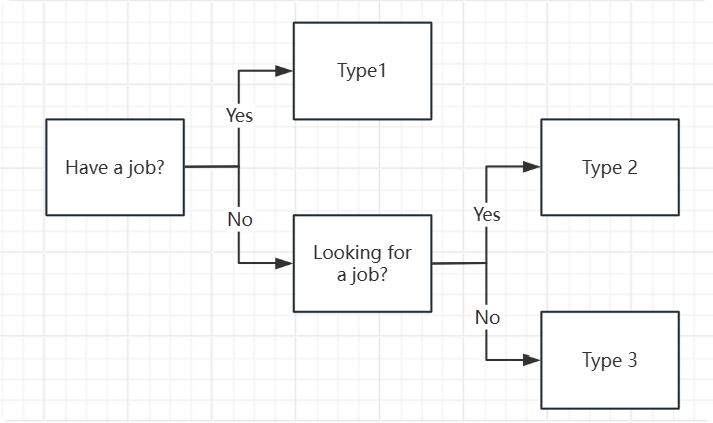

# Labour Data Visualization Project

👉 **[View Project](https://j4vixq.github.io/Labour-Market-Analysis/)**

---

### Data Preparation

Datasets are downloaded from https://www.ilo.org/

Datasets:
- Working-age population (thousands)
- Labour force participation rate (%)
- Employment-to-population ratio (%)
- Unemployment rate (%)

Filters:
- Sex: male, female, total
- Education: less than basic, basic, intermediate, advanced, not stated, total
- Place of birth: native, foreign, total

Metrics:
- Labour force participation rate (%) = (type1 + type2) / all
- Employment-to-population ratio (%) = type1 / all
- Unemployment rate (%) = type2 / (type1 + type2)

Data cleaning and dataset creation are in `backend/data_to_sqlite.ipynb`

### Backend

Uses Flask and SQLite3 in `backend/server.py`

### Frontend

Frontend is moved from `frontend` to root for live deployment.
